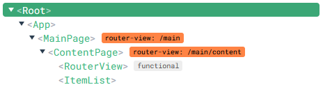
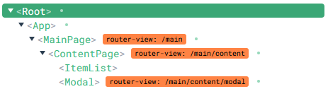

# vue-router-modal

## Project setup
```
npm install
```

### Compiles and hot-reloads for development
```
npm run serve
```

### Compiles and minifies for production
```
npm run build
```

### Lints and fixes files
```
npm run lint
```

### Customize configuration
See [Configuration Reference](https://cli.vuejs.org/config/).

# Component 구조
1. 초기 화면 > main/content

    

2. Modal 클릭 > main/content/modal
    
    RouterView가 Modal로 변경된다.
    
    

